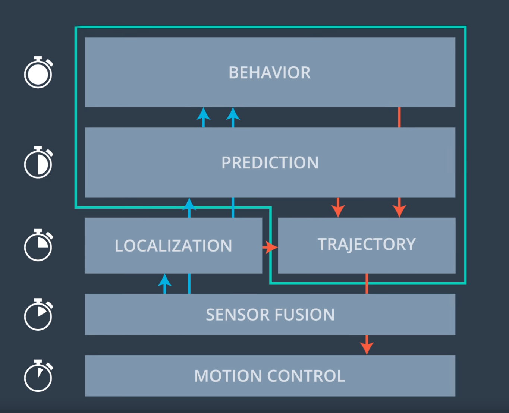
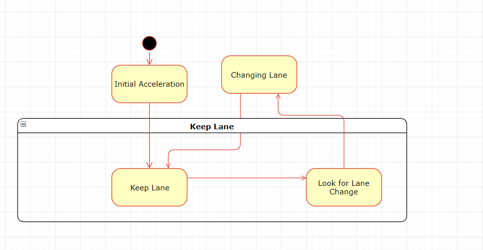
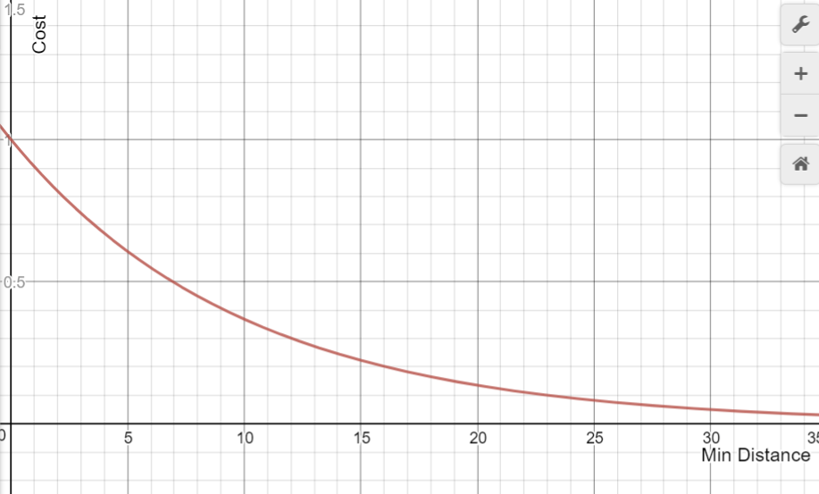
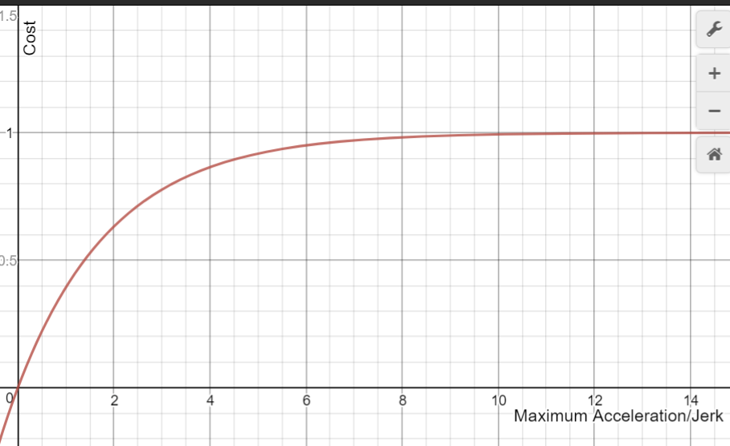

# CarND-Path-Planning-Project
Self-Driving Car Engineer Nanodegree Program  

### Goals
In this project your goal is to safely navigate around a virtual highway with other traffic that is driving +-10 MPH of the 50 MPH speed limit. The car's localization and sensor fusion data are provided, there is also a sparse map list of way points around the highway. The car should try to go as close as possible to the 50 MPH speed limit, which means passing slower traffic when possible. The car should avoid hitting other cars at all cost as well as driving inside of the marked road lanes at all times, unless going from one lane to another. The car should be able to make one complete loop around the 6946 m highway. Since the car is trying to go 50 MPH, it should take a little over 5 minutes to complete 1 loop. Also the car should not experience total acceleration over 10 m/s^2 and jerk that is greater than 10 m/s^3.

## Path Planner Overview

The path planner takes the input from other systems such as sensor fusion system, localization to know the state of the car and the surrounding objects. Based on this information the path planner should generate a trajectory and provide it to the motion controller.

The following picture shows the overview of an autonomous car software.

The blue box in the above picture shows the tasks of the path planner which are:

	- Behaviour Planning
	- Prediction
	- Trajectory Generation

These modules are explained below. 

## Behaviour Planning

The behaviour planning task takes high level decisions such as optimal route from start point to the goal, should the car keep the current lane or take left/right lane etc based on the current situation. The planning of route is usually done using a search algorithm such as A*. But for this project the car has to drive around a highway track there is no starting point and goal. So this is out of scope. 
The behavior planner implemented in this project takes only one of following high level decisions:

	- Drive with a constant speed in the current lane
	- Accelerate in the current lane
	- Brake in the current lane
	- change lane left at a constant speed
	- change lane right at a constant speed 

The behaviour planner is implemented using a finite state machine.

## Prediction

In this project a very simple prediction is used all the other cars are assumed to travel a constant speed in the current lane which the car is in at the moment. A prediction trajectory of neighboring cars are generated using this simple assumption. Which is used to calculate a cost for possible collision for different behaviour of our car. This is used by the state machine to choose appropriate action.  

## State Machine

The above picture shows the state machine of the behavior planner. It has three states at top level Initial Acceleration, changing lane and keep lane. The state initial acceleration is the state that the program starts with. This state generates a jerk minimal trajectory using the function Generatetrajectory() which generates a trajectory for a given set speed, set lane and duration.  The state Changing lane is active when the car changes lane. It generates a trajectory setting a constant speed which is the car speed during initiation of changing lane and this state is active until the car has changed its lane and it stays in the new lane for 1 s. Finally the last state is the keep lane state. This state is active during normal operation of the car.During this state the car monitors the behavior of other cars and responds based on the situation. The acceleration and braking is handled by the function keep_lane() which monitors the relative distance  and speed between our car and the car in front of our car in the current lane. Based on the relative distance and relative speed the keep_lane() function maintains the car speed relative to the car in the front and also keeps a minimum distance. The keep_lane() function returns a set speed which is used to generate trajectory. The keep lane state if our car is blocked by another car in the front and it cannot go with a normal speed then it will generate all possible trajectories i.e for keeping current lane and change to other possible lanes. Then the trajectory with minimum cost is selected. There are three cost functions used which are as follows:

	- Collision Cost
	- Acceleration and Jerk Cost
	- Inefficiency Cost

### Collision Cost

The collision cost function calculates the cost based on the minimum distance between our car and the neighboring cars.The function min_distance takes the trajectories of two cars as input and it goes through each points in the trajectory and returns the minimum distance between two trajectories. So if the minimum distance between two trajectories is zero than it means the two cars collide. The following formula is used to calculate the cost.

$cost = e^{-factor*MinDistance}$ 

The above picture shows the cost vs collision cost graph it can be seen that the cost is very high for low minimum distance and it reduces gradually.

### Acceleration and Jerk Cost

The acceleration and jerk function gets the generated trajectory and it calculates the magnitude of the acceleration and jerk for each point and the cost is calculated based on the maximum value. The following formula is used to calculate the acceleration and jerk cost.

$$costAccleration = 1 - e^{-factor*MaxAcceleration}$$ 
$$ costJerk 		  = 1 - e^{-factor*MaxJerk}$$ 
$$ cost = max(costAccleration,costJerk)$$ 

### Inefficiency Cost

The inefficiency cost is calculated based on the average lane speeds. The average speed of cars in each lanes are calculated in the function Sensor_fusion_processing() which is used for this calculation. The inefficiency cost is calculated using the following formula.

cost = (target_speed - average_lane_speed)/target_speed

### Sensor Fusion Processing

  The function sensor fusion processing is used to organise the sensor fusion data so that the other functions can use it easily without the need to search through sensor fusion data given by the simulator. This function stores the sensor fusion data in an unordered map with the car_id as the key for each car's data. The average speed of cars on each lanes are calculated and stored. The cars in front and rear of our car in each lanes are searched and its ids are stored. 

## Trajectory Generation

  The trajectory is generated using the jerk minimal trajectory generation algorithm. The trajectory generation is done using the GenrateTrajectory() and JMT() funcitons. The JMT() function gets the initial and the final state of the trajectory and it returns the coefficients of the trajectory polynomials. The GenerateTrajectory() function gets set longitudinal speed and set lateral position in frenet co-ordinate  as input and returns the points of the trajectory as an array in xy coordinate system. The GenrateTrajectory() function also gets the path length as input which determines the duration of the generated trajectory for a fixed sample time. The speed limit and acceleration limit are also imposed in the trajectory generation function though the acceleration is also influenced by duration of maneuver(path length). Using trial and error the path length and the limits for acceleration,braking, lane change maneuver were found. The initial and final position of the trajectory are calculated based on the inputs which are then used to calculate the polynomial coefficients using JMT(). 

## Performance of the algorithm

The algorithm is able to drive the car in the simulator fulfilling all the rubric points and it takes around 6 minutes to drive around the track. But still there is a lot of room for improvement. For example the prediction model can be improved to detect the lane changes. The behavior planner can be improved by including more states and cost functions. The planning algorithm can be developed better by testing individual functions but with this simulator it is quite difficult to do this because it is not possible to create scenarios.It would be much easier if individual parts are developed based on data and finally tested in the simulator.